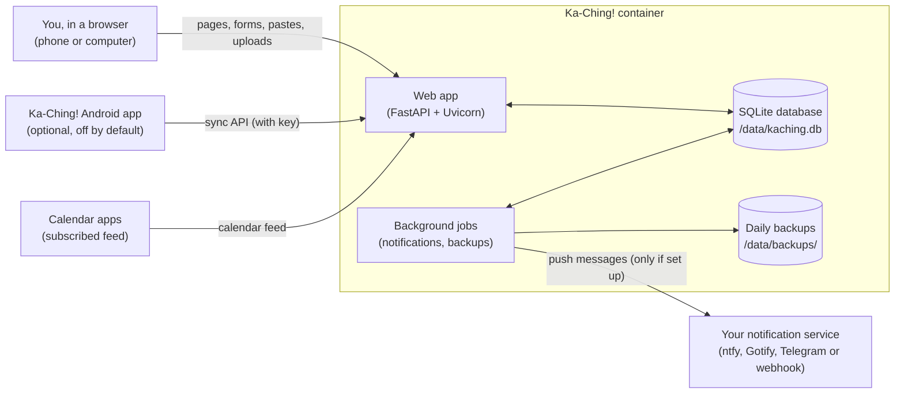

# Architecture

How Ka-Ching! is put together: who and what interacts with it, what each of
them can do, the parts of the code, and how data moves through it. For the
complete list of addresses and formats, see [INTERFACES.md](INTERFACES.md);
for the security view, see [SECURITY-ASSESSMENT.md](SECURITY-ASSESSMENT.md).

## The big picture

Ka-Ching! is a single self-hosted web app: one Docker container running a
Python web server, with all data in one SQLite database file on a volume
you own. There is no cloud service, account system or outside dependency at
runtime.



## Actors and what they can do

| Actor | How it connects | What it can do |
| --- | --- | --- |
| **You (the owner)**, in a browser | The web pages, over HTTP on your network (or HTTPS behind your own reverse proxy) | Everything: log orders by pasting a shop's order page or typing them in; edit, mark paid, delay, cancel or remove items; search; view the Dashboard, Orders, Calendar, Insights and Alerts; change settings (budget, categories, limits, layout, login, notifications); download, restore or reset data; download CSV and calendar exports |
| **Anyone else on your network** | The same web pages | Nothing, if the optional login is on (they get the sign-in page). If it's off, the same as the owner - which is why the login exists |
| **Calendar apps** | `GET /calendar/export.ics` | Read upcoming release days. While the login is on, only with the private key in the subscription link |
| **The Android app** (dormant) | `POST /api/sync` with the sync key | Two-way sync of items. Disabled unless `KACHING_PHONE_SYNC=1` is set *and* sync is switched on in Settings |
| **Background jobs** (inside the app) | Run on a timer in the same process | Daily at the chosen hour: due-tomorrow reminders, the budget alert and category-limit alerts. Weekly: the optional digest. Daily at 03:00: a backup, keeping the last 7 |
| **Your notification service** | Receives outbound HTTPS/HTTP posts from the app | Receive the messages above. Only contacted if you set a provider up; nothing else is ever contacted |
| **The maintainer** (via GitHub) | Pull requests, releases | Change the code, through reviewed and tested pull requests (see [MAINTAINERS.md](MAINTAINERS.md)) |

## The code

```
app/
  main.py            entry point (uvicorn app.main:app) - loads the parts below
  core.py            the app, page templates, middleware (one database
                     connection per request, optional login), and the
                     shared calculations: budget, shipping, alerts, categories
  pages.py           Dashboard, Orders, Calendar, Search, Insights, Alerts
  items.py           logging orders (manual and paste import), editing,
                     marking paid, delays, bulk actions
  settings_pages.py  the Settings page and everything it saves; backups,
                     restores and factory reset
  auth.py            the sign-in page and sign-out
  api.py             phone sync API, summary JSON, calendar feed, service worker
  parser.py          reading pasted order pages (Forbidden Planet, eBay,
                     Whatnot and a general reader for other shops)
  db.py              the database schema, upgrades, and connections
  notifications.py   settings storage and sending push messages
  templates/         the pages (Jinja2 HTML templates)
  static/            icons, logo and the web app manifest
tests/               automated tests, run on every pull request
.github/workflows/   tests, sign-off check, CodeQL, Scorecard, release signing
```

## How data flows

**Logging an order by pasting a page**

1. You paste the text of a shop's order page into Log orders.
2. `parser.py` works out which shop it is and reads the items, prices,
   dates, order number and shipping from it. Nothing is saved yet.
3. A review screen shows every item; you can fix names, prices, dates and
   categories, or untick items. Items already tracked in that order are
   marked and will be skipped.
4. On confirm, `items.py` saves the items to the database.

**Viewing the app**

Every page reads from the database at the moment you open it - totals,
budget, alerts and charts are worked out fresh each time, using the shared
calculations in `core.py` so every page agrees. Nothing is cached between
visits.

**Getting data out**

Full backups (the SQLite file itself), CSV exports of items and search
results, the calendar feed, and push notifications. Restoring a backup
replaces the database; a copy of the previous data is kept first.

## Storage

Everything lives in the `/data` volume: the database (`kaching.db`, plus
SQLite's `-wal` and `-shm` files), daily backups in `backups/`, and up to
three copies saved just before a restore. Settings - including the login's
password hash and the keys described in the security assessment - are rows
in the database's `settings` table.
