[](https://www.bestpractices.dev/en/projects/15163/baseline-1)
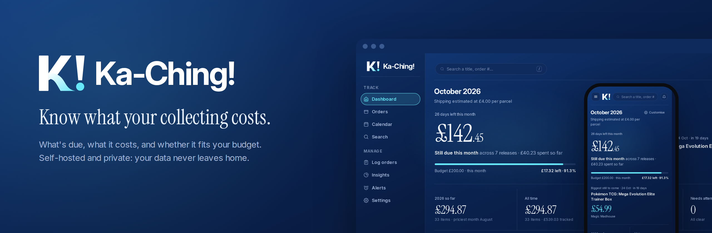

# Ka-Ching!

**This is not a collection catalogue.** It doesn't track what you own,
store cover art, or care about which variant is sitting on your shelf —
there are already excellent apps for that. Ka-Ching! answers exactly two
questions and nothing else:

- **What's due this week, and what will it cost?**
- **What's my forecast for this month (and next)?**

It started life as a comic pre-order tracker, and comics are still what it's
best at — but anything with a name, a price, a release date and a shop works
the same way, and since v3 you can sort it all into **categories** (Comics,
Manga, Pokémon cards, Funko Pop… or your own).

> **New in v3.1:** customise every page (show, hide and drag cards into
> your own order), layouts for wide landscape monitors, a budget split by category with optional per-category
> limits, an optional login, a `/` search shortcut, and a lot of polish.
> See [CHANGELOG.md](CHANGELOG.md). The old interface at `/classic/` has now
> been removed as planned — old links simply open the same page in the
> current one.

> **New in v3.0 — a completely new interface.** Dark neon redesign, a proper
> sidebar layout, a real phone layout, categories, a reworked Insights
> section, and a lot of smaller fixes. See [CHANGELOG.md](CHANGELOG.md) for
> the full list, and [Upgrading from v2](#upgrading-from-v2x) before you
> update — your data upgrades itself, nothing needs doing by hand.

> **About the Android app:** the Ka-Ching! Android app is **dormant for
> now**, and its repository is private until it's back. It was built against the old interface, and rather
> than ship it half-matched to v3, it's on hold until it can be properly
> reworked with the new look and fully re-tested against this release. To
> make sure nothing can sync against a server it hasn't been checked with,
> **phone sync is switched off and hidden by default in v3** — see
> [The Android app](#the-android-app-dormant) below. The web app is complete
> on its own and works fully on a phone browser.

> **Currency**: choose £/$/€ in Settings - this changes what's shown
> everywhere, and the paste-in importer and manual add form both recognise
> prices in whichever one you pick, so this genuinely works for US and
> European use, not just UK. The one thing that stays UK-specific: the shops
> with *dedicated* parsers (Forbidden Planet, eBay) are built around their
> UK pages specifically - anywhere else, use Manual Entry or the generic
> paste-in parser, which don't care which shop or currency they're reading.

## Gallery

Click any screenshot to view it full-size.

<table>
<tr><th>Dashboard</th><th>Orders</th></tr>
<tr>
<td><a href="screenshots/dashboard.png">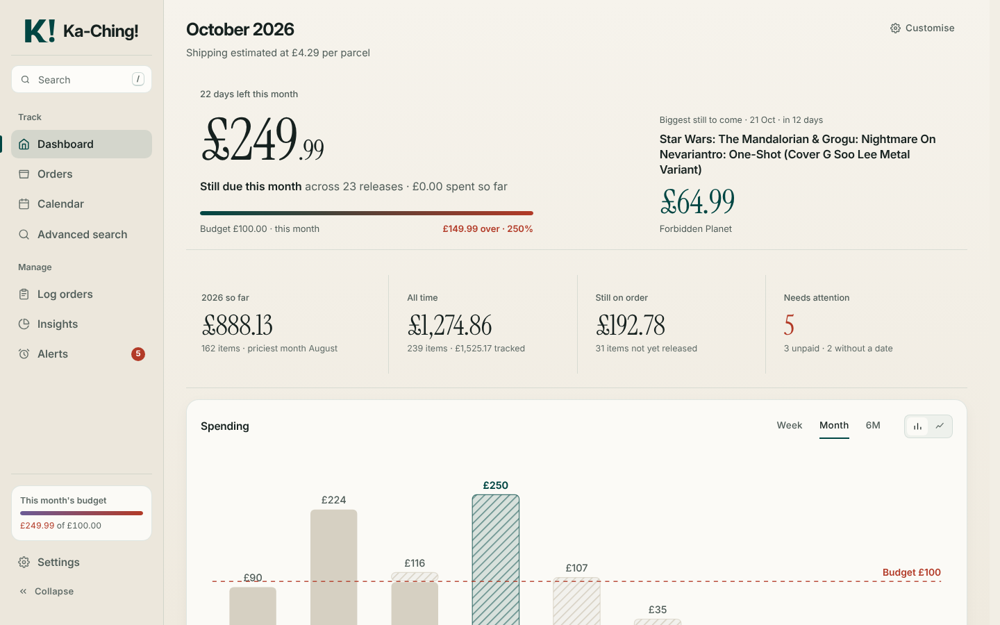</a></td>
<td><a href="screenshots/orders.png">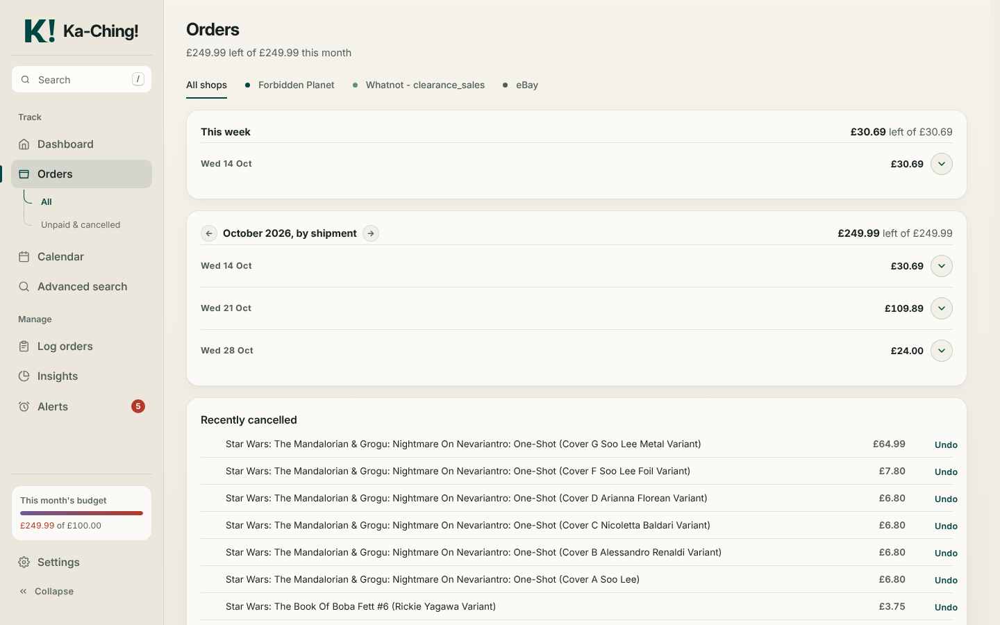</a></td>
</tr>
<tr><th>Calendar</th><th>Log orders</th></tr>
<tr>
<td><a href="screenshots/calendar.png">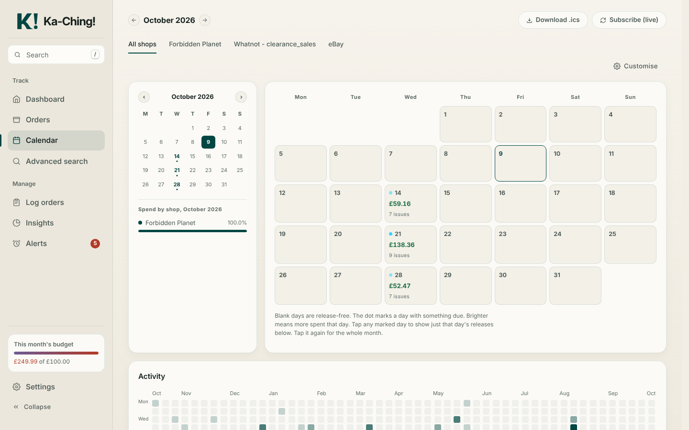</a></td>
<td><a href="screenshots/log-orders.png">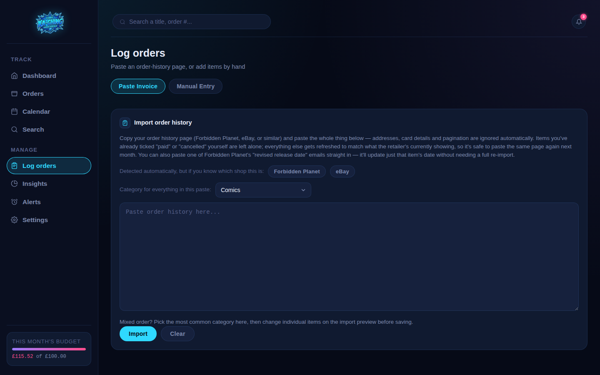</a></td>
</tr>
<tr><th>Insights</th><th>Price creep</th></tr>
<tr>
<td><a href="screenshots/insights.png">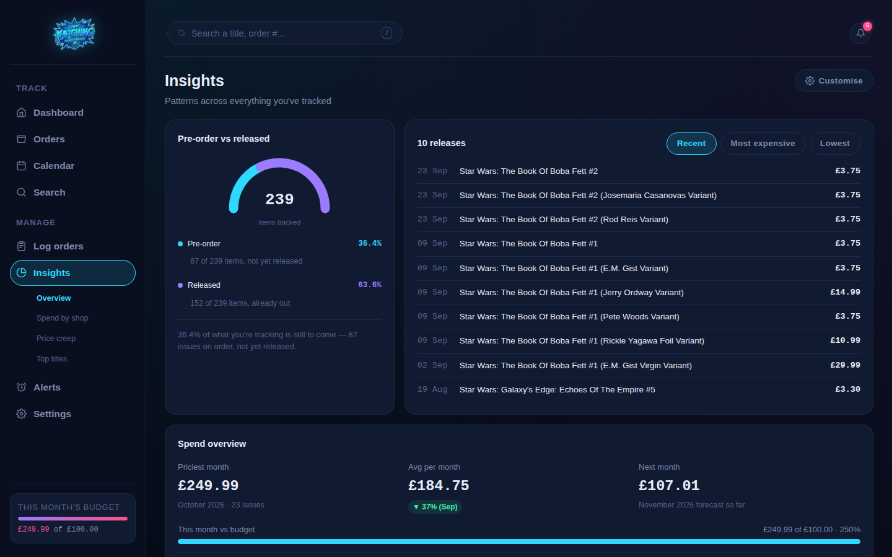</a></td>
<td><a href="screenshots/insights-2.png">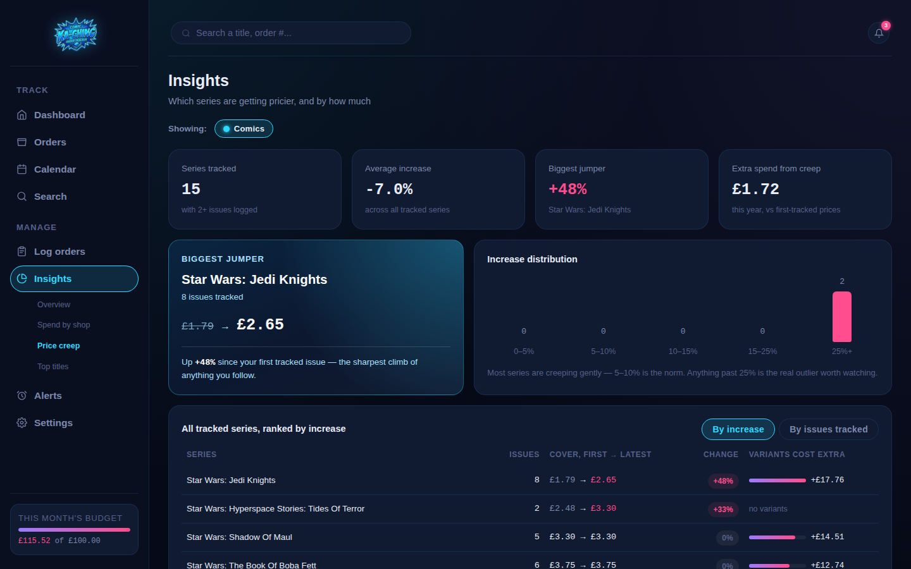</a></td>
</tr>
<tr><th>Spend by shop</th><th>Search</th></tr>
<tr>
<td><a href="screenshots/spend-by-shop.png">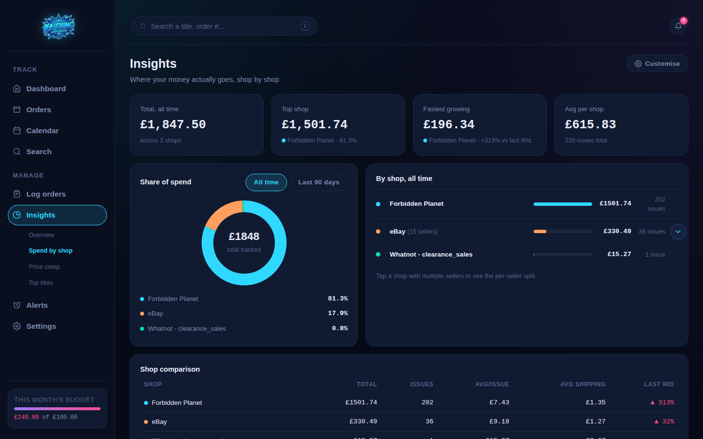</a></td>
<td><a href="screenshots/search.png">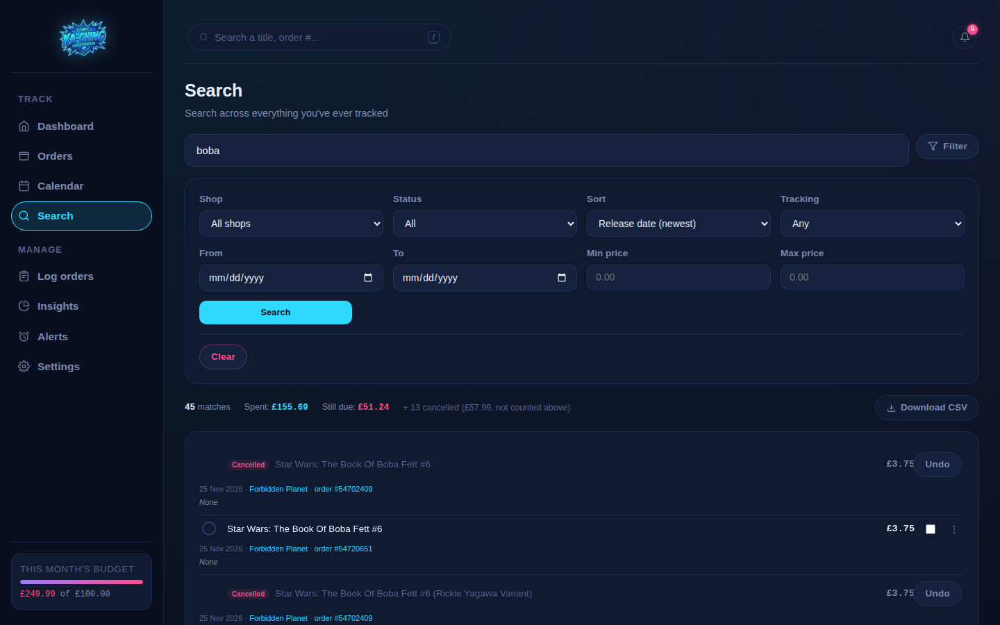</a></td>
</tr>
<tr><th>Customise mode</th><th>Settings → Layout</th></tr>
<tr>
<td><a href="screenshots/customise.png">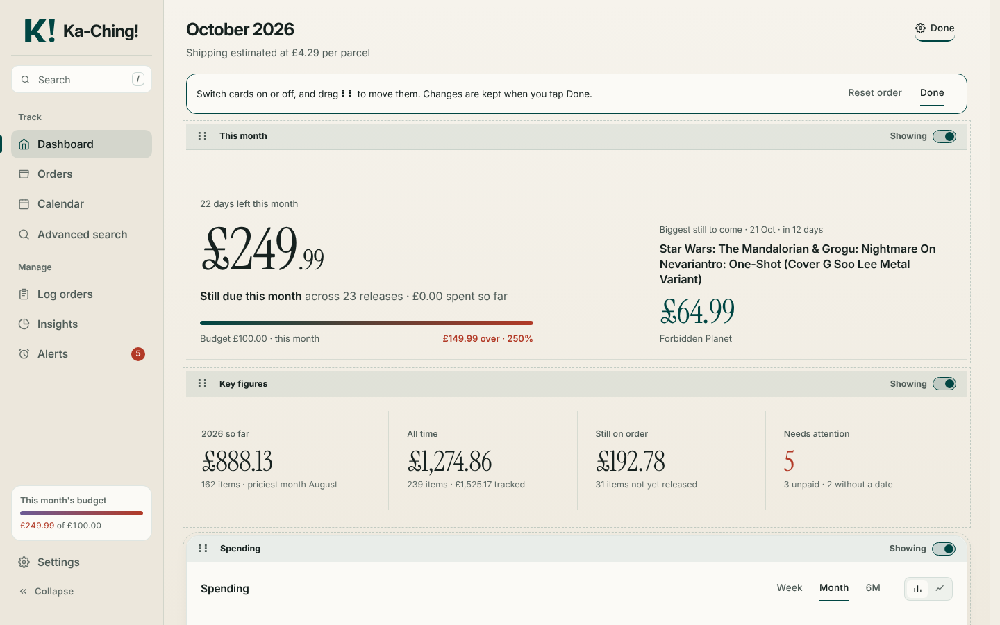</a></td>
<td><a href="screenshots/layout.png">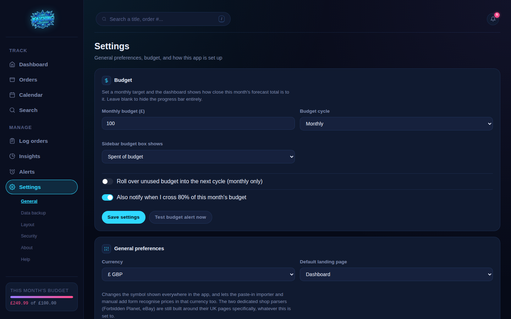</a></td>
</tr>
<tr><th>Alerts</th><th>Settings</th></tr>
<tr>
<td><a href="screenshots/alerts.png">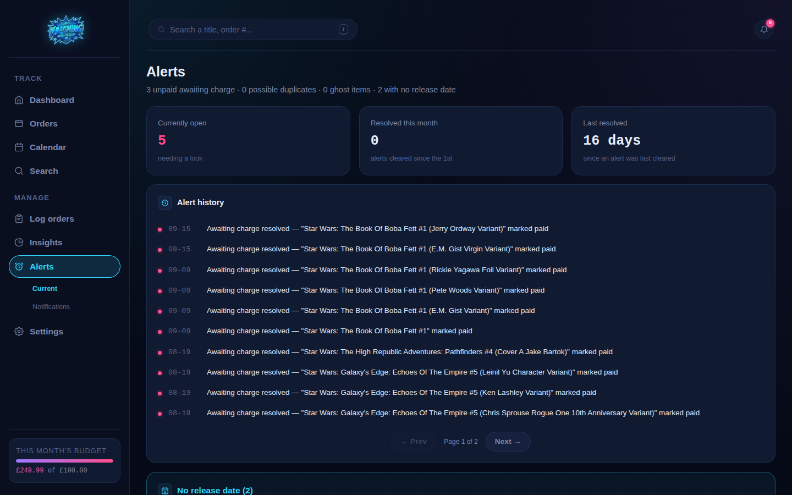</a></td>
<td><a href="screenshots/settings.png">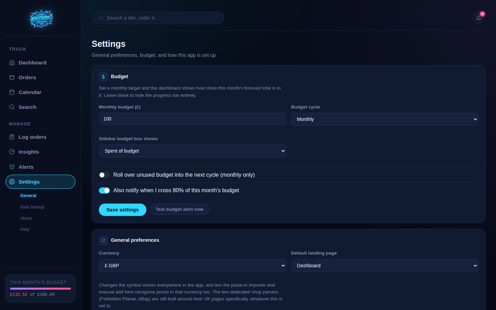</a></td>
</tr>
</table>

**On a phone:**

<table>
<tr><th>Dashboard</th><th>Menu</th><th>Calendar</th><th>Price creep</th></tr>
<tr>
<td><a href="screenshots/phone-dashboard.png">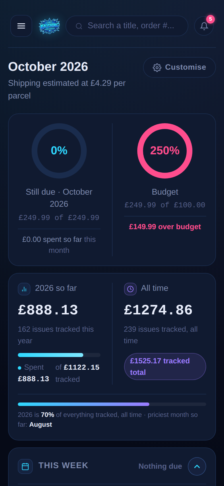</a></td>
<td><a href="screenshots/phone-menu.png">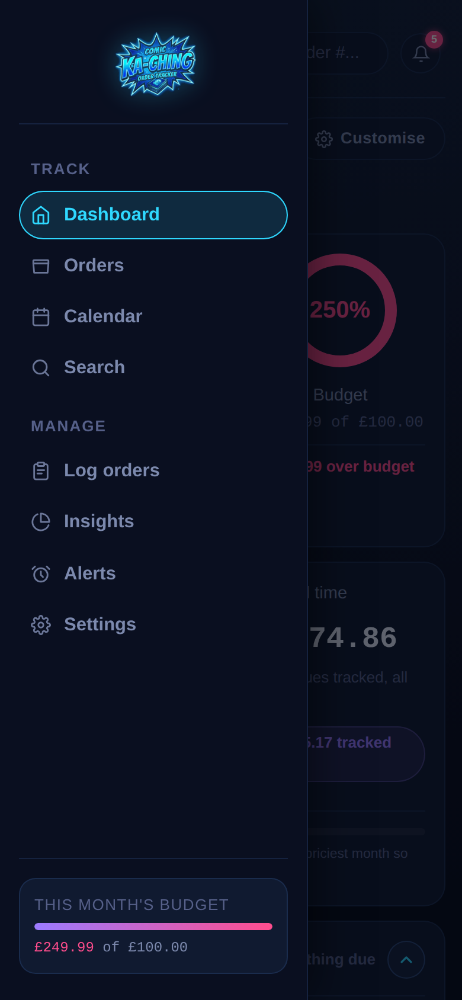</a></td>
<td><a href="screenshots/phone-calendar.png">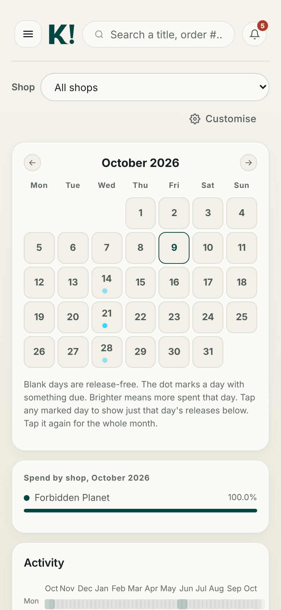</a></td>
<td><a href="screenshots/phone-insights.png">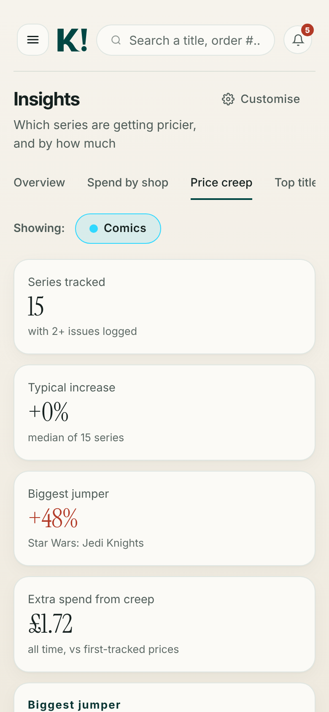</a></td>
</tr>
</table>

### Running in Dockge
<a href="screenshots/dockge.png">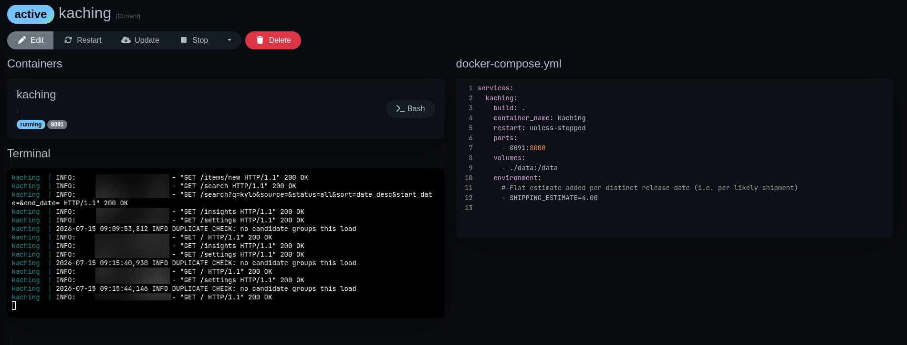</a>

## Your data is yours

Ka-Ching! runs entirely on your own server, under your own control. There's
no account to create, no cloud service sitting in the middle, no analytics,
no external fonts or scripts, and nothing phones home anywhere — the only
network calls it ever makes are ones you explicitly set up yourself (a
notification push through ntfy/Gotify/Telegram/a webhook, if and when you
choose to configure one).

Everything you paste in — every order, every price, every shop — lives in
one SQLite file on your own machine, and nowhere else. This project doesn't
want your data, doesn't have your data, and there's no mechanism by which it
ever could. **Settings → Data backup → Download backup** gives you the whole
database as a single file whenever you want it — genuinely yours, not
locked into anything.

## A tour of the interface

A sidebar on the left (a slide-out menu on phones) takes you everywhere.
Sections with more than one view — Orders, Insights, Alerts, Settings —
show their sub-pages under their sidebar entry, and as a row of pills under
the page title on a phone.

The **budget box** at the bottom of the sidebar stays in view however far
you scroll. Choose what it shows in Settings → Budget: spent of budget,
left/over, percentage used, a daily allowance, spent + still due, or hide
it. It turns pink once you're over.

Toggles, tabs and ranges you pick (chart ranges, series toggles, sort
orders, the Orders tab, Insights category chips…) are **remembered in your
browser** between visits. Page numbers and search filters deliberately
aren't.

**Make each page your own.** Dashboard, Calendar and the four Insights
pages have a **⚙ Customise** button by the page title. Each card then gets
a strip across its top with its name, a Showing/Hidden switch, and a **⠿**
handle — drag a card to put it where you want it (press and hold the handle
on a phone; hold a card near the top or bottom of the screen to scroll).
Half-width cards pair up side by side; one left on its own widens to fill
the row. **Reset order** puts a page back to normal. Your layout is saved on
the server, so it's the same on every device. **Settings → Layout** lists
every card on every page, with one-tap presets: *Everything*, *I don't
pre-order* (hides the still-due and on-order cards) and *Just the
essentials*.

**Wide landscape monitors** (about 1,900px across or more) get a choice in
Settings → Layout: **Standard** (the normal layout, centred), **Three
columns** (cards sit three to a row and use the full width) or **Side
panel** (an "At a glance" column on the right of every page with this
week, alerts and the biggest thing still to come). Phones, tablets, laptops
and portrait screens always use the normal layout.

On a computer, press **/** anywhere to jump into the search box (Esc to
leave it). Every expand/collapse section has a round chevron button, and on
Settings you can click anywhere on a section's heading to open it.

### Dashboard

- **Still due** and **budget** rings for the current month — the number
  that actually matters day to day, plus how close you are to your budget
  (and by how much you're over, if you are)
- **Your spending** — this year and all time side by side, what share of
  everything this year is, and this year's priciest month so far
- **Budget by category** — this cycle's spend as one bar split into category
  colours, with any category limits (see [Categories](#categories)); shown
  once you've spent in two or more categories or set a limit
- **This week**, grouped by likely shipment ("Nothing due" when it's quiet)
- An **Alerts** card (anything awaiting charge, duplicates, ghost items,
  items with no release date, categories over their limit)
- **Backup** — when the last backup was taken; if automatic backups are off
  it says so, with a one-tap **Turn on daily backups** button
- **Biggest still to come** — the single highest-value item not yet
  released, and the total size of everything still on order
- **Spend trend** with Week / Month / 6M ranges and Total / Items /
  Shipping toggles; hover (or tap) any point for the breakdown
- A note when a re-import moved an item's release date: which item, old
  date, new date

### Orders

Every item month by month, grouped **by shipment** (release date and shop),
with **All** and **Unpaid & cancelled** tabs, a shop filter, and
**Recently cancelled** with Undo.

Every item has a small circle next to it — tap it to mark that item paid.
Its cost moves from "still due" into "spent" immediately (it stays visible,
just dimmed and ticked). Tap it again to undo. The "&#8942;" menu on each row
holds **Cancel** and **Remove**:

- **Cancel** means "this was a real order and it's been cancelled" — it's
  reversible (Undo in Recently cancelled), and matches what re-importing
  would show once the shop itself marks it cancelled.
- **Remove** is a permanent delete, for bad data rather than a real-world
  event — a duplicate line that shouldn't exist, or a parsing artifact —
  and asks for confirmation since there's no undo.

A small checkbox on every row enables **bulk select**: a toolbar appears
with Mark paid, Cancel and Remove for everything selected at once.

Re-pasting your order history later won't undo a manual tick — once you've
marked something, that overrides whatever the retailer's page says about
it, until you hit Undo. Actions return you to exactly where you were: same
section, same month, same filters.

### Calendar

A month grid where release days show that day's total and item count,
shaded by how much is due, including estimated shipping (on a phone, just
the day and a dot). Each day in the releases list shows the same figure,
broken down as items + shipping, so the two always agree. **Tap a
day** to show only that day's releases in the list underneath; tap it again
(or "Show whole month") to go back. There's a mini calendar, a spend-by-shop
breakdown for the month, a year-long **activity heatmap**, and the full
releases list with the same pay circles and menus as Orders.

**Download .ics** exports every upcoming (non-cancelled) release as a
calendar file, one event per release day rather than one per variant, so
importing into Google Calendar, Apple Calendar or Outlook doesn't flood it
with near-duplicates. **Subscribe (live)** gives calendar apps that support
it an updating feed instead of a one-off file.

### Search

Find anything you've ever tracked — titles, order numbers and shop names —
filterable by shop, paid status, date range and price range, with sort
options (including "recently added", handy right after a big import), quick
This Month / This Year buttons, "Most expensive" / "Cheapest" shortcuts, and
a running spent / still-due total for whatever's filtered. Clicking an order
number isolates every other item from that order. **Download CSV** exports
exactly what's filtered.

### Log orders

Two tabs:

- **Paste Invoice** — paste an order page and review what was found before
  anything's saved (see [How importing works](#how-importing-actually-works-now)).
  Quick shop hints sit above the paste box, and you can pick the category
  for everything in the paste (and change individual items on the review
  screen).
- **Manual Entry** — set the release date and shop once, then add every item
  from that same order as its own row (name, category, price) before
  submitting. Optional order number, shipping cost (feeds that shop's exact
  shipping figure) and tracking number. The shop field remembers the shop
  you used last.

Click any item's name anywhere to **edit** it later — including **Delay this
item** (+30/+60/+90 days in one tap, logged like any other edit). Tracking
numbers are links: clicking one copies it and opens PostTrack.com's
tracking page.

### Insights

Four pages:

- **Overview** — spend overview, per-issue figures (priciest item, average
  issue), price distribution, shipping and patterns (busiest release day,
  money saved by cancelling, shipping vs cover price, by shop), a
  **cumulative spend** card for the current month (spent so far, how far
  over/under budget, what's still due, and one bar per release day — tap or
  hover a day for its items), **spend by category** (all time / this year),
  pre-order vs released, the 10 most recent releases and a 12-month trend.
- **Spend by shop** — a share-of-spend donut (all time / last 90 days),
  shop spend over 6 or 12 months with per-shop toggles, a per-shop
  comparison table, and every shop's all-time total. eBay sellers are
  grouped into one row — click it to expand each seller.
- **Price creep** — which series are getting pricier. It's based on
  **cover price**: the cheapest copy you bought of each issue number stands
  in for that issue's standard cover, so a £12.99 variant next to a £3.30
  cover no longer looks like a 300% price rise. Variants are shown
  separately as **"Variants cost extra"** — the average mark-up you pay for
  them over the standard cover. (If you only ever bought a variant of a
  particular issue, that variant counts as its cover.) The **Typical
  increase** tile is the median across your series, so one odd series can't
  drag it off course, and each series has a dot in its category's colour.
- **Top titles** — your priciest items, and the series you've spent the most
  on, with a full series comparison.

Price creep and Top titles have **category chips** at the top: tap a
category to include or leave it out. Categories with **Numbered issues**
switched on start switched on.

### Alerts

- **Current** — anything **awaiting charge** (released but still unpaid and
  unmarked), **possible duplicate orders**, **items with no order number**,
  **items with no release date** (with a *Set date* button — they can't
  appear on the calendar or in any month until they have one), **categories
  over their limit**, plus open / resolved-this-month / last-resolved counts
  and an alert history.
- **Notifications** — set up daily/weekly pushes and the budget alert (see
  [Notifications](#notifications)).

### Settings

- **General** — currency, budget (and cycle, rollover, and what the sidebar
  budget box shows), default landing page, **category limits**,
  **categories** and **shops** (rename or merge a shop across every item in
  one go; shipping estimates carry over).
- **Data backup** — download / restore a backup, automatic daily backups
  (last 7 kept), the **before-restore copies** a restore saves first (newest
  3 kept, each downloadable), full spend-history CSV, notification settings
  export / import, and a factory reset (type-to-confirm; wipes tracked items
  only).
- **Layout** — which cards show on each page, and the wide-screen layout
  (see above).
- **Security** — the optional login (see [Signing in](#signing-in-optional)).
- **About** and **Help** — a getting-started guide and FAQ.

## Categories

Every item has a category. A starter list is created automatically
(Comics, Manga, Omnibus / collected editions, Pokémon cards, Pokémon sealed
products, Magic: The Gathering, Funko Pop, DVD / Blu-ray, Books, Vinyl,
Coins, Gold / silver, Other), and you can add your own anywhere a category
is picked — just type a new name. Each gets its own colour automatically. In
Settings → Categories you can switch on **Numbered issues** for anything
sold as #1, #2, #3… (comics, manga volumes) so Price creep and Top titles
track price rises per series, or remove a category that isn't in use (the
default category can't be removed).

**Category limits** (Settings → General) give any category an optional
spending limit per budget cycle — e.g. £60 on comics, £40 on cards. The
list shows the categories you switch on, anything with items, and anything
with a limit already (the rest are under *Show all*). The Dashboard's
**Budget by category** card shows each category's share of the budget, a
category goes pink when it's over its limit, and it shows in Alerts — with a
push notification (once per category per cycle) if budget alerts are on.
Limits follow your budget cycle and count spend exactly the way the overall
budget does; a parcel's shipping is shared across its items' categories by
price.

Existing items become **Comics** when you upgrade. Category is included in
backups and both CSV exports.

### Duplicate order detection

If the same comic, same release date, ends up tracked under two different
order numbers, a warning shows up on the **Alerts** page (and the Alerts card on the Dashboard) — this is almost always an
accidental double-order rather than two genuinely different things releasing
the same day (this is exactly how Ka-Ching! caught a real duplicate order
during testing). Each entry gets its own &times; (cancel) and **Remove**
button, or a "Not a duplicate" button on the group if it's genuinely
intentional — dismissing it stops that specific pairing being flagged again.

This only catches duplicates spread across two different order numbers. If
the same item shows up twice under the *same* order number — a genuine
double-line-item, not a double-order — it won't trigger this warning, since
there's nothing to "cancel" on Forbidden Planet's side. Use **Remove**
directly on the extra line instead.

## How importing actually works now

Pasting an order no longer saves anything straight away. Instead:

1. **Ka-Ching! tries to recognise what you pasted**, in order: Forbidden
   Planet's exact format first (the only one that's fully reliable), then
   eBay's order-detail format (also a real dedicated parser, since eBay's
   page shape is consistent regardless of seller - detects the order
   number, seller, total, and every item and price; since these aren't
   pre-orders, items default to the order's own delivery date, or its
   placed date if it hasn't been delivered yet, and are marked
   paid/dispatched automatically if the order shows as delivered. Shipping
   isn't a guess either - eBay's own Total already includes postage, so
   subtracting the sum of the items gives the exact amount paid for
   shipping, feeding straight into that seller's own shipping calibration.
   A bulk eBay purchase-history paste often contains several separate
   orders back to back - Ka-Ching! splits these apart automatically, so
   each item ends up tagged with its own correct seller, order number,
   and shipping figure rather than everything getting lumped into
   whichever order happened to be first), then Whatnot's order
   confirmation email (item, price, order number, and exact shipping,
   marked paid automatically since Whatnot charges at checkout rather
   than on release like a pre-order shop),
   then a generic parser built around patterns common to small-shop
   checkouts generally (most run on shared platforms like Shopify, so
   confirmations tend to share a recognisable shape - Order Number /
   itemised list / Subtotal / Shipping / Total - even when the exact
   wording differs).
2. **You land on a review screen** showing exactly what it found - name,
   price, and release date per item, all editable, plus the shop, order
   number, and shipping if detected. Nothing has been written to the
   database at this point.
3. **Anything it couldn't confidently work out is left blank**, never
   guessed at - an item with only "expected in stock late August" rather
   than an actual date gets no release date, so you fill that in yourself
   rather than Ka-Ching! inventing one.
4. **Possible duplicates are flagged right on this screen** - if something
   with the same name already exists under a different order number, it's
   called out before you've committed to anything, not after.
5. **Untick anything you don't want, fix anything that's wrong, add a row
   by hand if something got missed, then confirm.** Only then does anything
   actually get saved.

For a shop Ka-Ching! doesn't recognise as Forbidden Planet, you'll be asked
to confirm which shop it's from on the review screen - type it once, and it
becomes a known option in the shop dropdown everywhere else in the app from
then on. Detected shipping gets stored as that shop's own real shipping
figure, feeding into...

## Shipping - exact per order first, estimates only as a fallback

Different shops charge different amounts for postage, and - especially on
eBay - the same seller can charge completely different shipping from one
order to the next, depending on item count, weight, or a free-shipping
threshold. Averaging a seller's past orders would be actively misleading
here, so it isn't done: whenever the *exact* postage for a specific order
is known (which it always is for a properly-imported eBay order, and for
Forbidden Planet order-detail pages with a postage breakdown), that real
figure is used directly for that order, immediately - no waiting for
several orders to build up an average.

An estimate only ever applies as a fallback, for orders where the real
figure genuinely isn't known - Forbidden Planet pre-orders imported from
the order-history page alone (no exact postage line), calibrated from that
shop's declared order totals once there's enough data, or the flat default
if there's nothing to calibrate from yet.

This is also where the review screen mentioned above adds real value -
now that a parsing mistake shows up on-screen before anything's saved,
rather than needing to be caught after the fact. The exact shipping figure
detected for an order shows there too, so it's visible immediately rather
than only provable by checking the database.

## Running it

```bash
docker compose up -d --build
```

Then visit `http://<server-ip>:8091`.

Data lives in `./data/kaching.db` (SQLite) — back it up like you would any
other stack config.

### Upgrading from v3.0

`git pull` and `docker compose up -d --build`, as always. Nothing needs
doing by hand: your data and settings carry straight over. The old
interface at `/classic/` is gone, as announced in v3.0 — any `/classic/…`
link now opens the same page in the current interface.

### Upgrading from v2.x

Replace the code and rebuild, same as always:

```bash
git pull
docker compose up -d --build
```

What happens:

- **Your data upgrades itself** the first time v3 starts: categories are
  added and every existing item becomes **Comics**. Nothing you've tracked
  is changed or lost. (Taking a backup first — Settings → Download backup —
  is still a good habit.)
- **The new interface is at the normal addresses** (`/`, `/orders`,
  `/calendar`…). Your bookmarks keep working.
- The old v2 interface isn't included any more (v3.0 kept it at `/classic/`
  for one release); old `/classic/` links open the same page in the new one.
- **Phone sync is off** — see [The Android app](#the-android-app-dormant).
- Some remembered choices (which sections were expanded) reset once.

Restoring a backup taken from an older version also works: it's upgraded
straight away when restored, with no restart needed.

### Configuration

Environment variables, set in `docker-compose.yml`:

- `SHIPPING_ESTIMATE` — flat cost added per distinct release date within a
  month (default `4.00`). Change this to match what your retailer actually
  charges you per parcel.
- `KACHING_PASSWORD` — optional master password for the login. When set,
  the login is always on with this password and can't be switched off from
  the web UI; it's also the way back in if you forget the password set in
  Settings → Security (see [Signing in](#signing-in-optional)).
- `KACHING_PHONE_SYNC` — off by default. Set to `1` to bring back the Sync
  settings and the `/api/sync` endpoint for the Android app. Only do this if
  you know what you're doing — see [The Android app](#the-android-app-dormant).
- `DEBUG_TOOLS_ENABLED` — off by default. Set to `true` to turn on a
  developer diagnostic view at `/debug/shipping-groups?source=<shop
  name>&key=<your sync key>`, listing every shipment for a given shop with
  its real-vs-estimated status - built for tracking down a shipping-total
  mismatch, not something most people will need.

## Signing in (optional)

Ka-Ching! has no login by default — fine on a home network. If it can ever
be reached from outside yours, switch one on in **Settings → Security**:
pick a password (stored hashed, never as plain text) and every page, export
and action then asks for it. The sign-in page can keep you signed in for 30
days on that device; without it you stay signed in until the browser
closes. **Sign out** is in the sidebar, changing the password signs every
other device out, and five wrong attempts lock sign-in for a minute.

While the login is on, the Calendar's **Subscribe (live)** link carries a
private key (calendar apps can't type passwords) — re-add it in your
calendar app after switching the login on.

**Forgotten the password?** Add `KACHING_PASSWORD=something` under
`environment:` in `docker-compose.yml` and rebuild. That password always
works and the login can't be switched off while it's set. Sign in with it,
set a new password in Settings → Security, then remove the line and rebuild
again — your new password takes over.

## Importing your order history

1. Open your retailer's order history page (log in first).
2. Select all the text on the page (or as many pages as you want) and copy it.
3. Paste the whole thing into **Log orders → Paste Invoice** and hit
   Import.
4. Repeat monthly, or whenever you place new pre-orders — duplicates are
   silently skipped.

The parser is tolerant of pagination artifacts (page breaks that split an
item's price across two pages) — if an item's price genuinely gets lost in
the copy-paste, that one item is skipped rather than risk recording a wrong
figure. Everything else still imports fine.

Re-pasting the same page updates anything that's changed since (e.g. a
pre-order that's since shipped and been charged) — unless you've manually
ticked Paid or Cancel on it yourself, in which case your tick always wins.

### Release-date-change emails

Forbidden Planet emails you separately whenever a pre-order's release date
moves — a completely different format to the order-history page (no price,
no images, dates written as DD/MM/YYYY). You can paste one of these emails
into the same Import box - it's recognised as its own kind of paste, shows a
simple review screen listing exactly which item(s) will get which new date,
and only updates them once you confirm. Nothing else changes and no new
items get added.

This only understands the one email template Forbidden Planet was sending as
of when this was built — if they change the wording or you spot one that
doesn't get picked up, paste an example and it can be adjusted.

## More than one shop

Ka-Ching! can read Forbidden Planet, eBay and Whatnot pages directly, and
has a generic parser for most small-shop checkouts. For anything else, use
**Log orders → Manual Entry**.

**eBay purchases from different sellers share one shop filter.** Each seller
still gets its own colour and label within the item lists, but filters show
a single combined "eBay" option rather than one per seller, which got
unwieldy fast. Since eBay orders are typically already paid and delivered,
filtering to eBay on the forward-looking views (This week, this month) will
usually turn up nothing due — Search covers your full purchase history.

Once more than one shop is being tracked, a shop filter appears on Orders and
Calendar (a dropdown on phones), and any day with releases from more than one
place shows each shop labelled separately in its own colour.

## Notifications

**Alerts → Notifications** sets up a daily check — once a day, Ka-Ching! looks at
what's releasing tomorrow and sends a single push through whichever service
you configure, grouped by shop, e.g. *"Tomorrow: 3 items, £11.48 — Forbidden
Planet: 2 items, £8.49 · Cocktails and Comics: 1 item, £2.99."* Stays
completely silent on quiet days — no pointless daily pings when nothing's due.

An optional weekly digest can run alongside the daily one - same idea, but
covering the next 7 days rather than just tomorrow, sent once a week on
whichever day you pick.

A separate **budget alert** can fire once your monthly budget crosses 80% -
a fixed threshold, not something to tune per person, on the reasoning that
one sensible default beats a slider nobody actually adjusts. Fires at most
once per budget cycle.

Supports **ntfy**, **Gotify**, **Telegram**, or a **custom webhook** — pick
one from the dropdown, fill in its details (server URL + topic for ntfy,
server URL + app token for Gotify, bot token + chat ID for Telegram), and set
what time of day the check should run.

The custom webhook option covers anything else - Discord, Slack, Home
Assistant, Node-RED, a script of your own. Set the URL and a JSON template
with `{title}` and `{message}` placeholders, and Ka-Ching! POSTs that
payload whenever it would otherwise notify you - no native integration code
needed for whatever service you actually want to use.

Two buttons let you confirm it's actually working before relying on it:
- **Send test notification** — an immediate, generic ping, just to prove the
  connection details are right
- **Test tomorrow's digest now** — sends the real message you'd get
  tomorrow (or "nothing releasing" on a quiet day), without waiting for the
  scheduled time

This all runs inside the container itself — no cron job to set up, no
external scheduler. It just needs the container running once a day at the
time you pick.

## Using it on a phone

Every page has a proper phone layout: the sidebar becomes a slide-out menu
(☰), cards stack one per row, section tabs become a pill row under the page
title, shop filters become a dropdown, charts keep readable labels, and wide
tables become one tidy block per row instead of scrolling sideways.

**Install to home screen** — Ka-Ching! can be added to your phone's home
screen like a normal app (look for "Add to Home Screen" or an install icon
in your browser). Same container underneath, just full-screen with its own
icon instead of a browser tab.

## The Android app (dormant)

There's a separate Ka-Ching! Android app (its repository is private while
it's dormant) —
a genuinely separate, local-first project with its own database and parsers,
which could optionally sync with this server.

**It's dormant for now.** It was built to match the v2 interface, and v3
changed a lot. Rather than leave it half-matched, it's on hold until it can
be properly reworked with the new look and re-tested end to end against
this release. Until then:

- **Sync is switched off and hidden** in v3: no Sync settings, no "last
  synced" indicators, and the server refuses sync requests. Your existing
  sync key isn't deleted, so nothing needs re-pairing later.
- The server side of sync has already been made category-aware and safe for
  older app versions (an app that doesn't know about categories can never
  clear one), so it'll be ready when the app is.

If you really want to keep using the current app build in the meantime, set
`KACHING_PHONE_SYNC=1` in `docker-compose.yml`, rebuild, and switch **Phone
app sync** on in Settings → Sync. That combination isn't tested or supported
until the app's update is released.

## If something looks wrong

Every action that changes an item's status or release date — clicking the
paid circle, cancelling, undoing, a re-import refreshing something, a
release-date email updating something — gets logged, along with the exact
before/after state. If a duplicate warning reappears, or anything else looks
like it silently changed on its own, check:

```bash
docker logs kaching
```

Look for lines starting `MARK request`, `MARK result`, `IMPORT REFRESH`,
`EMAIL DATE UPDATE`, or `DUPLICATE CHECK` — between them they show exactly
what happened to a given item and when, rather than needing to reconstruct it
from memory afterwards.

There's also a standing check on the **Alerts** page for items tagged
Forbidden Planet with no order number at all ("ghost items") — always a parser artifact from an
earlier version, never legitimate, since every real Forbidden Planet item
comes with an order number attached. If any show up there, they're almost certainly duplicates of something already
tracked properly; check before removing.

## Optional: a weekly/monthly nudge via ntfy

The app exposes a small JSON endpoint at `/api/summary`:

```json
{
  "week_total": 27.88,
  "week_item_count": 3,
  "month_total_estimate": 72.88,
  "month_item_count": 9,
  "month": "May 2026"
}
```

`scripts/ntfy-digest.sh` wraps this into an ntfy push. It needs `curl` and
`jq` (Aegis likely already has both; otherwise `apt install jq`).

```bash
export NTFY_TOPIC=kaching           # required
export KACHING_URL=http://192.168.0.178:8091   # default shown, override if needed
export NTFY_URL=https://ntfy.sh     # default shown, point at your own ntfy server if self-hosted

./scripts/ntfy-digest.sh weekly     # "This week: £27.88 across 3 issue(s)."
./scripts/ntfy-digest.sh monthly    # "May 2026 forecast: £72.88 across 9 issue(s), incl. est. shipping."
```

Suggested crontab, run from wherever the script lives (e.g. alongside your
other scheduled jobs on Aegis - the folder path below is whatever this
actually lives in on your server):

```cron
0 8 * * 1   NTFY_TOPIC=kaching /opt/stacks/kaching/scripts/ntfy-digest.sh weekly
0 8 1 * *   NTFY_TOPIC=kaching /opt/stacks/kaching/scripts/ntfy-digest.sh monthly
```

This is left as a script you run yourself, rather than built into the
container, so the container keeps doing exactly one job — serving the
dashboard — reliably.

## What this deliberately doesn't do

- No collection cataloguing, no barcode scanning, no cover art
- No accounts, no cloud, no analytics, no telemetry of any kind
- No login/auth — put it behind your existing reverse proxy (NPM/Authelia)
  the same way as everything else, since it has no auth of its own
- No automatic scraping of the retailer site — paste-in only, so nothing
  breaks silently when a retailer changes their page markup

It's a small, honest tool that does one job on hardware you own, with data
that never leaves it.

## Contributing a new shop's parser

Ka-Ching! only knows how to reliably read Forbidden Planet, eBay, and
Whatnot, because those are the ones that have actually been built and
tested against real orders. If you shop somewhere else and want that shop
supported too, that's genuinely welcome — but it has to start from a real
example, not a guess, since retailer pages are full of small surprises no
one would think to account for in advance.

**The right way to contribute one:** take a real order confirmation or
order-history page from that shop, and manually replace anything personal —
your name, address, card details, real order numbers, real dates — with
made-up values, while keeping the actual page structure, wording, and layout
exactly as it really appears. The structure is what a parser is built from;
none of it depends on the content being real. Then open a GitHub issue with
that sanitised example and a note on what shop it's from.

This is deliberately a manual, human step rather than an automated "share my
data" button. An automated redaction tool can miss things a person reviewing
their own paste wouldn't - a stray reference number, something unexpected in
a link - and Ka-Ching!'s whole point is that nothing about it ever has an
automated path for data to leave your server, even a well-intentioned one.
A hand-sanitised example keeps that promise intact while still giving enough
to build from.

If you're comfortable writing the parser yourself, pull requests work the
same way - just make sure any example text included with it is sanitised
the same way first.

## AI involvement

Ka-Ching! was built through heavy, iterative collaboration with an LLM
(Claude). A lot of the actual code came out of that process rather than
being hand-typed line by line - but every feature, every parser, and every
decision about what this should and shouldn't do was directed and made by
a real person, not generated and shipped unchecked.

In practice that meant: every parser here was built from a real, messy,
copy-pasted example rather than a guessed-at format, tested against actual
orders before being trusted, and fixed properly (sometimes across several
rounds) when real data revealed something a reasonable guess wouldn't have
caught. Scope decisions - what Ka-Ching! does and deliberately doesn't do,
the licence, what got rejected outright - were all real calls made by a
person, not defaults left unquestioned.

Happy to go into more detail on the actual process if anyone's curious -
open an issue.

## Licence

Licensed under [AGPL-3.0](LICENSE). You're free to read it, learn from it,
fork it, and contribute back - but if you modify it and run your own version
(including as a hosted service), you're required to keep your version open
source too, under the same licence. That's the deliberate point: it stops
this quietly becoming someone else's closed, rebranded product, while still
keeping the project genuinely open for anyone who wants to build on it
honestly.
